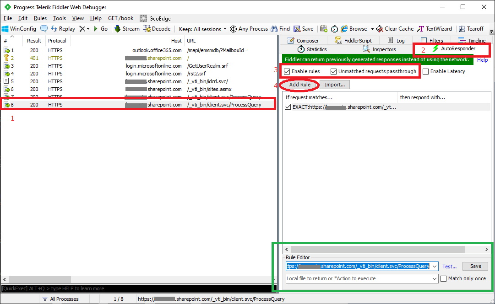
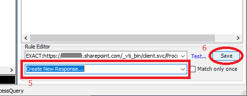
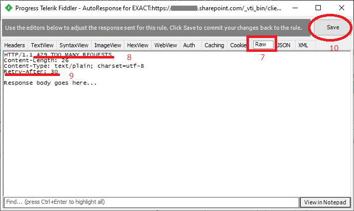
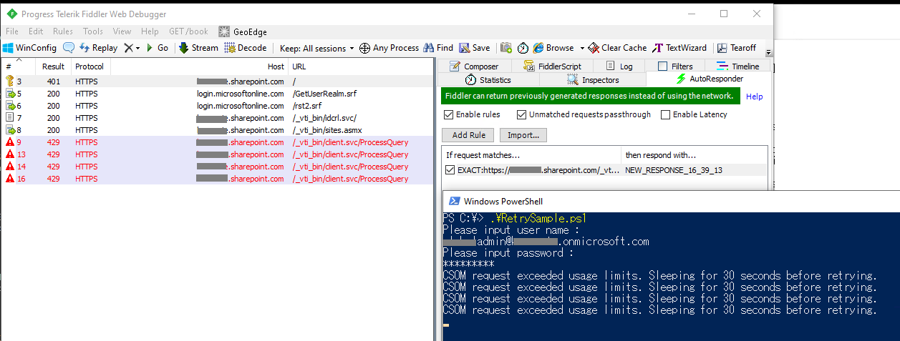

# HTTP 調整のリトライロジックのテスト方法

# 背景
HTTP 調整リトライ ロジックを実装した際に、特に弊社公開記事に記載されたカスタムコードを変更している場合は、論理テストを実施していただく必要があります。

残念ながら、SharePoint Online に対して明示的に調整を発生させることはできないため、現実的なシナリオに即したテストなどを実施することはできません。
テストのためにクラウド側に不要な負荷をかけることも適切ではない行動となります。
そのため、基本的には論理テストを実施し、様々な想定シナリオに対するロジック テストをパスした後で、テスト済みのコードをマスターに組み込むという方法が現実的です。

今回の記事では、その疑似的な論理テストを実施する方法の 1 つをご紹介します。

# 対処策
Fiddler の AutoResponder を使用して、CSOM などの通信に対して、任意の HTTP 応答を返して動作検証する方法があります。

まず、Fiddler を起動し、トレースを取得しておきます。

1) 応答を書き換えたい通信を、画面左ペインから選択します。
2) [AutoResponder] タブをクリックします。
3) Enable Rules と Unmatched requests passthrough がチェックされていることを確認します。
4) [Add Rule] をクリックします。

次に緑の欄の設定に移ります。

5) Rule Editor の下のセレクトボックスで [Create New Response...] をプルダウンから選択します。
6) [Save] をクリックすると、ダイアログがポップアップされます。

7) [Raw] タブをクリックします。
8) HTTP 応答のステータス コードに 429 TOO MANY REQUESTS を指定します。
9) HTTP 応答ヘッダーに Retry-After を指定して、任意の数値を指定します。
 テスト用ですので、短い値でも問題ありません。

10) [Save] をクリックします。
11) ダイアログを [x] を押して閉じます。

この後、Fiddler を起動してロジックをテストしてください。指定された間隔でリトライが実行されることが確認できます。

# 参考リンク

タイトル : SharePoint Online で調整またはブロックを回避する方法
アドレス : https://docs.microsoft.com/ja-jp/sharepoint/dev/general-development/how-to-avoid-getting-throttled-or-blocked-in-sharepoint-online

タイトル : SharePoint Online の HTTP 調整 (応答コード 429, 503) に関して
アドレス : https://social.msdn.microsoft.com/Forums/ja-JP/8e5a4116-c96a-4d3e-9bbf-6efb852b5d88/sharepoint-online-12398-http-3551925972-2454031572124671254012489-429-503?forum=sharepointsupportteamja

タイトル : [再改訂版] SharePoint Online HTTP 調整 (応答コード : 429) 対策の増分バックオフ リトライ
アドレス : https://social.msdn.microsoft.com/Forums/sqlserver/ja-JP/21e2a628-44be-4541-bca9-b81c484ff59b/20877259133533029256-sharepoint-online-http-3551925972?forum=sharepointsupportteamja

タイトル : jpspsupport/CSOMRetrySample
アドレス : https://github.com/jpspsupport/CSOMRetrySample

