本記事では、サポートへのお問い合わせ時に必要な情報をスムーズにご提供いただくことを目的として、HAR（HTTP Archive）ファイルの取得方法を説明します。

<!-- more -->

>**NOTE**
>- 本記事では Microsoft Edge での操作手順を説明します。
>- 具体的な採取対象や手順は、お問い合わせ内容や事象によって異なる場合があります。
>   - 本手順は基本的な参考資料としてご活用ください。
>   - 本記事の手順がすべての状況に適用されるわけではない点についてご了承ください。
>   - 追加の資料や手順が必要な際は、担当エンジニアが詳細をご案内いたします。
>       

## 目次
- [事前準備](#事前準備)
  - [事前準備 1](#事前準備-1-時刻表示)
  - [事前準備 2](#事前準備-2-開発者ツールの設定)
- [取得手順](#取得手順)
  - [1.録画の開始](#1-録画の開始)
  - [2.ネットワーク トレース ログの取得](#2-ネットワーク-トレース-ログの取得)
  - [3.コンソール ログの取得](#3-コンソールログの取得)
  - [4.録画の停止](#4-録画の停止)
  - [5.事前準備設定を元に戻す](#5-事前準備設定を元に戻す)
- [参考公開情報](#参考公開情報)

HAR ファイルとは、ブラウザーの開発者ツールで取得するネットワーク トレース ログの保存ファイルです。ページの表示や各種操作で発生する ブラウザーとサイト間のやり取りをログとして記録します。
ネットワーク トレース データを取得する際には、同時に動画を取得いただくことがあります。これは、どのような操作をどのようなタイミングで行い、どのような画面や動きとなったのかを正確に把握するためです。
本記事では、HAR ファイル取得と同時に動画も取得いただく場合の手順を説明します。


## 事前準備
必要に応じて、事前準備を実施します。

### 事前準備 1 (時刻表示)

事象発生の正確な時間を動画で把握するために、PowerShell 画面に秒単位の時刻を表示させておきます。
動画を取得する際は、この時刻が動画範囲に入るようにしてください。

1. PowerShell を起動します（管理者権限は不要です）。
2. 次のコマンドをコピーして実行します。
```powershell
while ($true) {
    Clear-Host
    Get-Date -Format "HH:mm:ss"
    Start-Sleep -Seconds 1
}
```
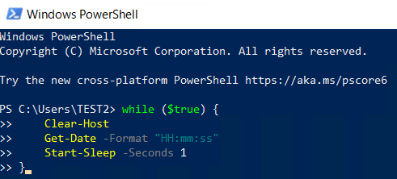

3. 秒単位の時刻が PowerShell 上に表示されます。

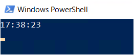

### 事前準備 2 (開発者ツールの設定) 

1. Microsoft Edge を起動します。
2. アドレスバーに "about:blank" と入力して空白ページを表示します。
3. ブラウザー上で [F12] キーを押します。Developer Tool が起動します。
4. 画面右上の三点リーダーから設定を開きます。


5. 次の項目にチェックを入れます。

**■ Edge のバージョン 130 以降を利用している場合**
セクション：ネットワーク
項目　　　：Allow to generate 'HAR' with sensitive data

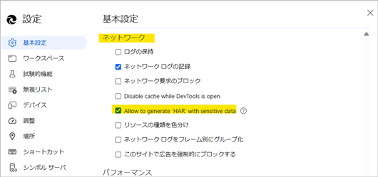

**■ コンソール ログも取得する場合**
セクション：コンソール
項目　　　：タイムスタンプ / Timestamps

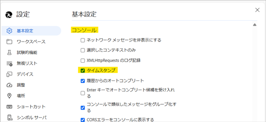

6. 設定画面を右上の×ボタンで閉じた後、ブラウザーを終了します。

>**補足**
>Chromium 130 以降から、機密情報を含む可能性がある Cookie や Authorization ヘッダーの情報が、既定で HAR ファイルから除外されるようになりました。本設定をオンにすることで、Cookie や Authorization ヘッダーの情報を HAR ファイルにエクスポートできるようになります。
>

## 取得手順
  
#### <u>1. 録画の開始</u>
Snipping Tool または PowerPoint を使って動画の録画を開始します。   

<details>
<summary>Snipping Tool の場合（Windows 11 の場合のみ）</summary>

1. 事象発生端末にて Snipping Tool を開きます。
スタート メニュー > 検索バーで "Snipping" と入力しアプリを検索してください。
2. 画面上部のビデオアイコンをクリックして、録画モードに変更します。

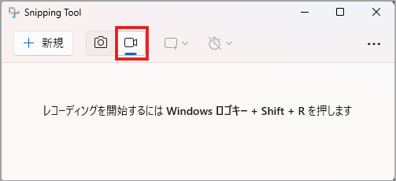

3. [＋新規] ボタンをクリックし、録画領域を選択します。
ブラウザー全体および PowerShell の時刻表示が確認できるよう範囲を選択してください。
4. [スタート] ボタンをクリックします。

 
</details>

<details>
<summary>PowerPoint の場合</summary>

1. 事象発生端末にて PowerPoint を開き、新しいプレゼンテーションを選びます。
2. [挿入] タブ > [メディア] > [画面録画] ボタンをクリックします。

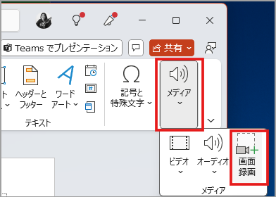 

3. 画面上部のメニューから [領域の選択] をクリックし、録画領域を選択します。
ブラウザー全体および PowerShell の時刻表示が確認できるよう範囲を選択してください。

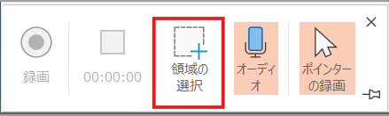

4. [録画] ボタンをクリックします。

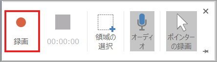
</details>

>**NOTE**
>- お使いのバージョンによって、若干メニューが異なる場合があります。
>- Windows 10 の Snipping Tool には録画機能がありません。Windows 10 の場合は PowerPoint をお使いください。

#### <u>2. ネットワーク トレース ログの取得</u>
1. Microsoft Edge を起動します。
2. アドレスバーに "about:blank" と入力して空白ページを表示します。
3. ブラウザー上で [F12] キーを押し、開発者ツールを起動します。
4. [ネットワーク / Network ] タブを選択します。
5. [ログの保持 / Preserve log] [キャッシュを無効にする / Disable cache] にチェックを入れます。
6. [フィルター] アイコンをクリックしてフィルターメニューを表示し、[すべて / All] を選択します。
7. [ネットワーク ログのクリア] アイコンをクリックします。
8. [ネットワーク ログの記録] アイコンがアクティブ（赤色）になっていることを確認します。
   - 赤色は記録が開始されていることを示します
   - ボタンがグレーの場合は記録が停止していますので、ボタンをクリックしてアクティブ（赤色）にしてください

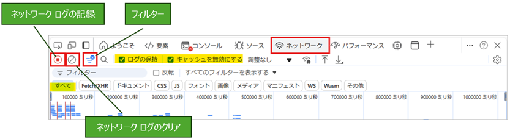

9. 開発者ツールを開いているタブ上で事象が発生するサイトにアクセスし、事象を再現します。
10. 事象の再現が完了したら、[ネットワーク ログの記録] アイコンをクリックして記録を停止します。
11. [HAR のエクスポート] アイコンを長押しします。
12. [HAR のエクスポート (機密データを含む) / Export HAR (With sensitive data)] を選択します。

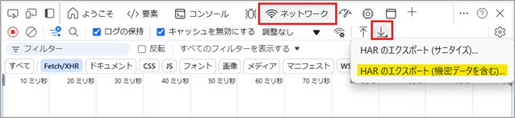

13. 任意の場所に HAR ファイルを保存します。

>**NOTE**
>- 別のタブでアクセスするとログが記録されません。
>- タブが遷移する事象はログを記録できない場合があります。
>- [HAR のエクスポート (機密データを含む)] を選択することで、Cookie や Authorization ヘッダーの情報を HAR ファイルにエクスポートできます。
>- 長押しで当該メニューが表示されない場合、事前準備２を実施していない可能性があります。設定を確認の上、もう一度、ログを採取し直してください。

#### <u>3. コンソールログの取得</u>
コンソール ログを採取することで、JavaScript などのクライアント サイド スクリプトのエラーを確認することができます。
1. 開発者ツール画面上部の [コンソール] タブを選択します。
2. コンソール内に、事象の再現中に出力されたエラー、警告、または情報メッセージが記録されていることを確認します。
3. コンソール内を右クリックし、[名前を付けて保存... / Save as]を選択します。
任意の場所にコンソール ログをテキスト形式で保存します。<br>


#### <u>4. 録画の停止</u>
録画を停止します。

<details>
<summary>Snipping Tool の場合</summary>

1. 画面上部の録画停止ボタンをクリックします。

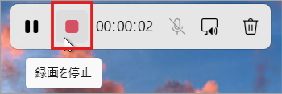 
2. 動画ファイルは既定では自動保存されます。
保存場所は、画面右上の三点リーダー […] ＞設定から [画面録画の保存先] をご確認ください。<br>
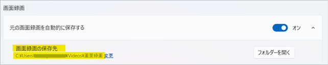 
</details>

<details>
<summary>PowerPoint の場合</summary>

1. 画面上部の停止ボタンをクリックします。<br>
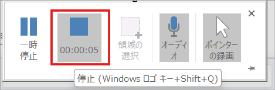 
2. スライドに動画が貼り付けられますので、PowerPoint ファイルを任意の場所に保存します。
</details>

#### <u>5. 事前準備設定を元に戻す</u>
1. 事前準備 1 で起動した PowerhSell を × ボタンで閉じます。
2. 事前準備 2 で 「HAR (センシティブ データを含む) の生成を許可する / Allow to genarate 'HAR' with sensitive data」にチェックを入れた場合は、HAR ファイル取得後にチェックをオフにします。


手順は以上となります。<br><br>

## 参考公開情報
[ネットワーク トレースの収集方法 | Microsoft Learn](https://learn.microsoft.com/ja-jp/azure/azure-web-pubsub/howto-troubleshoot-network-trace#collect-a-network-trace-in-the-browser-browser-based-apps-only)
[トラブルシューティングのためにブラウザー トレースをキャプチャする - Azure portal | Microsoft Learn](https://learn.microsoft.com/ja-jp/azure/azure-portal/capture-browser-trace)

取得した HAR ファイルおよび動画ファイルは、サポート エンジニアからご案内させていただく保存先へ格納してください。
本記事に関するご不明点、疑問点などがありましたら、お問い合わせ担当のサポート エンジニアまでお問い合わせください。