# Power Automate で簡単な承認フローを作成する

今回の投稿では、SharePoint Online における [SharePoint 2010 形式ワークフローの廃止](https://support.microsoft.com/ja-jp/office/1ca3fff8-9985-410a-85aa-8120f626965f?ui=ja-jp&rs=ja-jp&ad=jp) (MC217999) に際して、移行先となる Power Automate を簡単に紹介します。

これまで移行先の Power Automate の採用を決定できない一つの要因に、Power Automate に慣れていないことが挙げられていることがあると思います。
Power Automate の承認ワークフローを作成する方法は、様々な方々がすでに画面付きで手順を公開しておりますので、新たに作成する方法はないかと当初は考えました。しかしながら、初学の場合においては資料との相性等もあるかと思いますので、少しでも参考資料の選択肢が多い方がいいと思います。

そこで、本投稿でも手順を紹介します。現行バージョンの Power Automate でのご説明になりますが高度なものは作成せず、シンプルな処理で構成し、細かな操作を説明し、スピーディにキャッチアップできる形を目指します。

## 移行シナリオの参考情報
SharePoint 2010 形式ワークフローからの移行を検討している方には、マイクロソフトからの公開情報としては以下のサイトをご確認いただくことをお勧めします。

タイトル : Power Automate の Microsoft SharePoint コネクタ
アドレス : https://docs.microsoft.com/ja-jp/sharepoint/dev/business-apps/power-automate/sharepoint-connector-actions-triggers

タイトル : Power Automate を使用して SharePoint でドキュメントの承認を要求する
アドレス : https://docs.microsoft.com/ja-jp/sharepoint/dev/business-apps/power-automate/guidance/require-doc-approval

下記サイトには、SharePoint ワークフローと Power Automate の機能の対比表が含まれています。

タイトル : ガイダンス: SharePoint で従来のワークフローから Power Automate フローに移行する
アドレス : https://docs.microsoft.com/ja-jp/sharepoint/dev/business-apps/power-automate/guidance/migrate-from-classic-workflows-to-power-automate-flows

## ウォークスルー
それでは、実際に Power Automate で処理を作成していき、操作に慣れることを目指しましょう。

### 1. コマンド バーより [自動化] – [Power Automate] – [フローの作成] をクリックします。
モダン UI で、リストやライブラリを表示すると、コマンドバーに [自動化] というメニューがあります。SharePoint は、ここからフローの作成を開始できます。

### 2. 画面右に現れるフローの作成ペインにて [詳細の表示] を展開し、[新しいファイルが SharePoint に追加されたときに、カスタムアクションを完了する] をクリックしてフローの作成を開始します。

Power Automate では、シナリオに合わせてテンプレートを選択して、フローの作成を行うことができます。
そのため、SharePoint へのコネクターや、必要最小限の処理が含まれた状態で、フローを作成できるため生産的です。

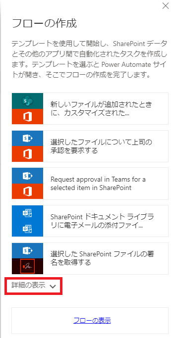
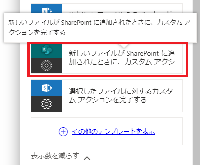

### 3. [続行] をクリックします。

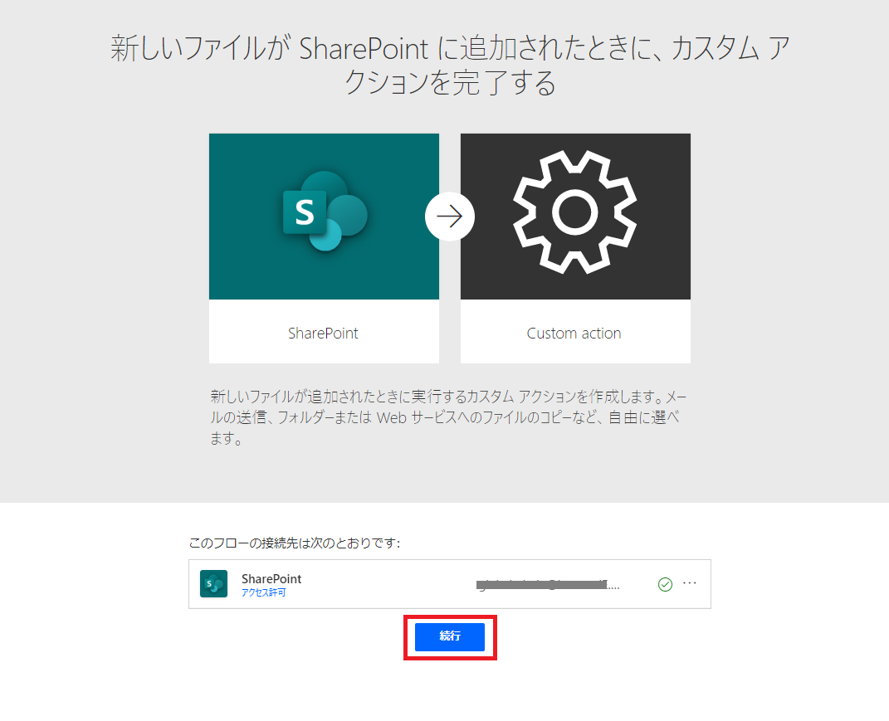

### 4. フローの編集画面に遷移しました。[+ 新しいステップ] をクリックして後続の処理を追加していきます。
ライブラリにファイルがアップロードされて処理が開始するという部分ができあがった状態でスタートします。当初の設定値などは、色々と観察してみてください。

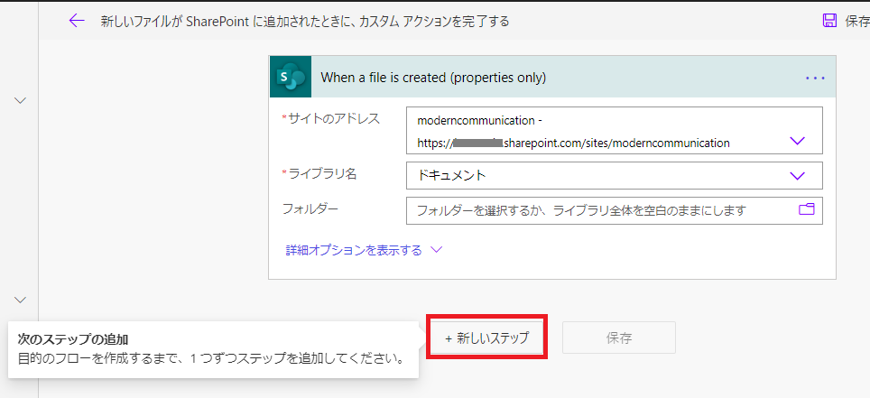

#### 補足
処理の最後ではなく、途中にアクションを差し込む場合は、アクション間にある線をポイントすると (+) マークが表れます。

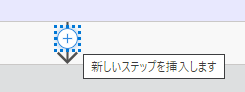

さらに [アクションの追加] を押すと、アクションが挿入できます。

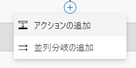

### 5. アクション選択画面で “承認” を検索し、[開始して承認を待機] を選択します。

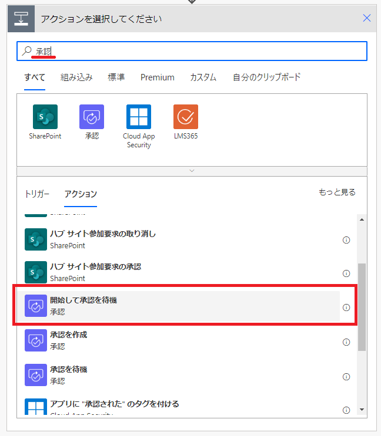

アクションについては、画面上側にサービス、下側にトリガーとアクションが表示されます。
検索機能はそれぞれに適用されます。ここでは “承認” を検索していますが、”承認” サービスだけではなく、承認というキーワードに該当するアクションを持つ各種サービスと、そのトリガーやアクションがすべて表示されています。
どのようなサービス、そしてそのトリガーやアクションが使用できるかは、公開情報を調べても結構ですし、ご自身で色々と検索しながら確認することもできます。

### 6. “承認の種類” にて、”カスタム応答 – 1 つの応答を待機” をクリックします。

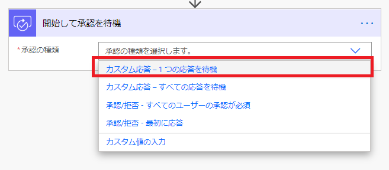

### 7. "開始して承認を待機" アクションの詳細を指定していきます。

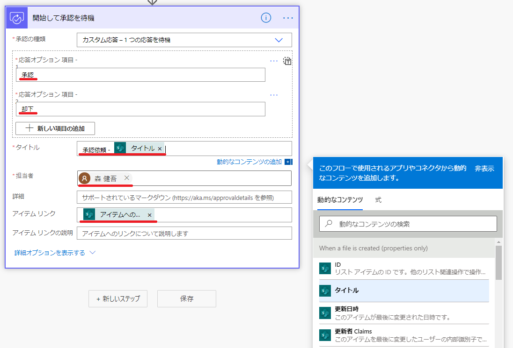

応答オプションには、承認者が選択する応答の選択肢 (例 承認、却下) を定義します。

各種エディターについてですが、アクションの各プロパティに直接文字入力をすると文字列の固定値が指定されます。
動的なコンテンツ (値) を扱いたい場合は、入力項目にフォーカスを当て、画面右下の吹き出しコンテンツから値を選択して使います。

### 8. 同じ要領で [+ 新しいステップ] をクリックして "条件" アクションを追加します。

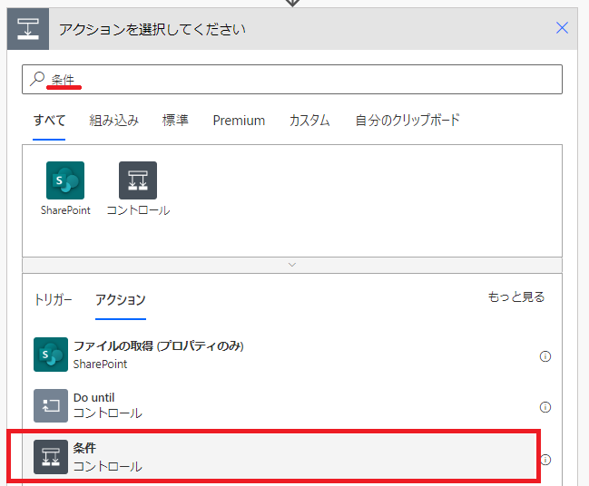

### 9. 条件の左辺より順に、動的な値から “応答”, "次の値に等しい", 文字列直接入力にて "承認" などと指定します。

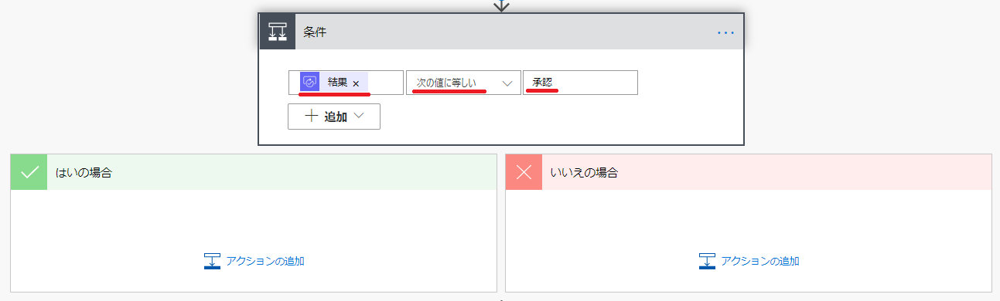

1 つの応答を待機するモデルであれば、”結果” という値に、承認者が選択した値が入ってきます。
この値が “承認” ならば “はい” の方へ、そうでなければ “いいえ” の方に流すようにします。

### 10. はい、いいえのそれぞれのブロックにて、[アクションの追加] をクリックし、”項目の更新” アクションを挿入します。

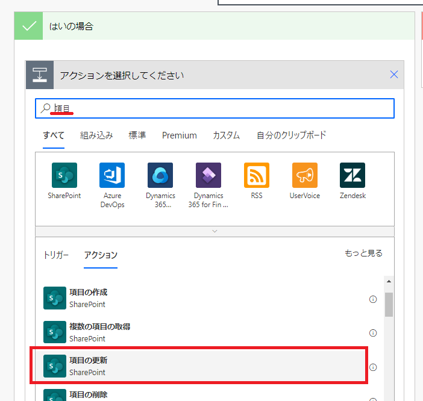

### 11. それぞれ、承認済みか却下という値を列に書き込むに今回のサンプルはとどめます。

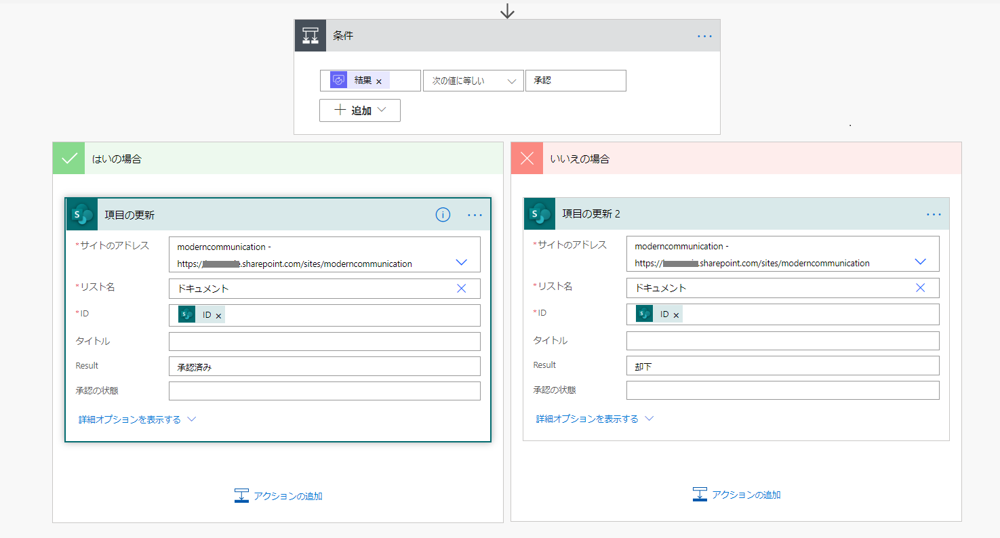

## 実行確認
ユーザー エクスペリエンスを確認してみましょう。

ファイルをアップロードしてみてください。
しばらくすると承認者宛に以下のようなメールが届きます。

そこで [承認] を選択して、[送信] をクリックすると、承認処理が完了です。

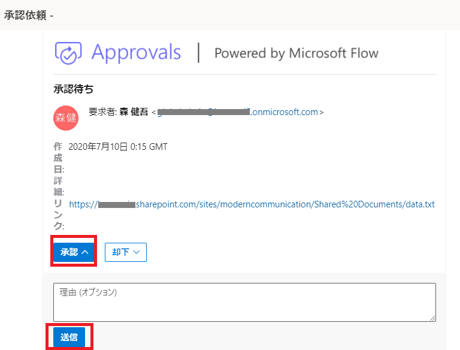

Result 列に承認済みが記録されました。

## その他、トラブルシューティング等

エラーがある場合は、フローの編集画面から [左矢印] をクリックして、概要ページ内にある実行履歴をクリックします。
この画面内に失敗のエントリーがあれば、それをクリックしてトラブルシューティングすることができます。

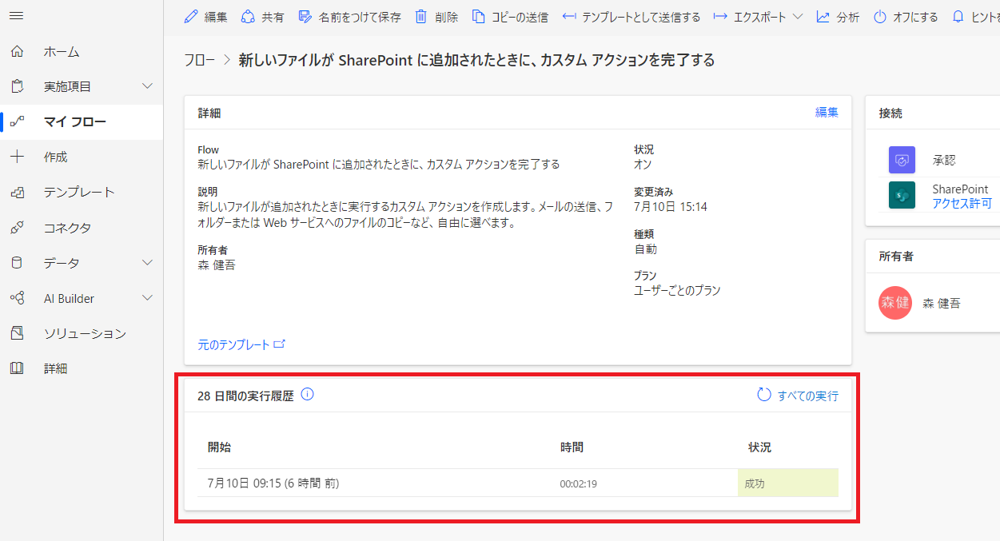

初めてのテクノロジーにおいても、スモール スタートで利用開始し、そこから少しずつテストしながら追加していくことで、ソリューションを作成できるものと考えております。
是非移行作業を進める上で、上記資料を準備にお役立てください。

