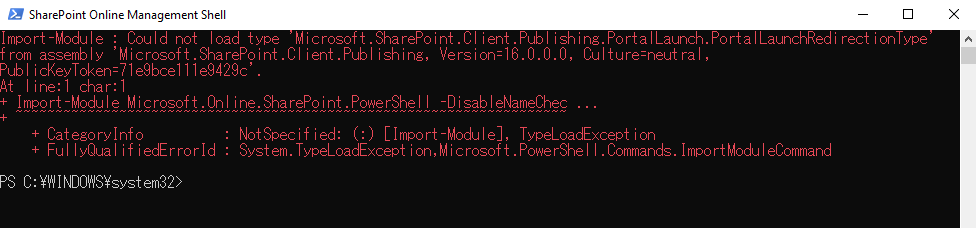
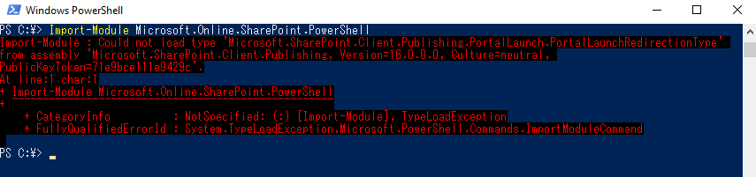

# SharePoint Online 管理シェルは SharePoint Online Client Components SDK がインストールされた端末で使用できません

SharePoint Online 管理シェル (SharePoint Online Management Shell) と SharePoint Client Component SDK を同じ端末上にインストールした場合、SharePoint Online 管理シェルの起動時にモジュールの読み込みに失敗し、エラーが発生します。



このエラーは、Windows PowerShell 上で "Microsoft.Online.SharePoint.PowerShell" モジュールを指定してインポートした場合にも同様に発生します。



<エラー メッセージの抜粋>
```
Import-Module : Could not load type 'Microsoft.SharePoint.Client.Publishing.PortalLaunch.PortalLaunchRedirectionType'
from assembly 'Microsoft.SharePoint.Client.Publishing, Version=16.0.0.0, Culture=neutral,
PublicKeyToken=71e9bce111e9429c'.
At line:1 char:1
+ Import-Module Microsoft.Online.SharePoint.PowerShell -DisableNameChec ...
+ ~~~~~~~~~~~~~~~~~~~~~~~~~~~~~~~~~~~~~~~~~~~~~~~~~~~~~~~~~~~~~~~~~~~~~
    + CategoryInfo          : NotSpecified: (:) [Import-Module], TypeLoadException
    + FullyQualifiedErrorId : System.TypeLoadException,Microsoft.PowerShell.Commands.ImportModuleCommand
```

エラーを回避して SharePoint Online 管理シェルを利用するには、SharePoint Online Client Components SDK をアンインストールする必要があります。
本内容は、以下の公開情報にも記載されております。

タイトル : SharePoint Online 管理シェルを使用して作業を開始する
アドレス : https://docs.microsoft.com/ja-jp/powershell/sharepoint/sharepoint-online/connect-sharepoint-online?view=sharepoint-ps
```
SharePoint Online 管理シェル モジュールと SharePoint クライアント コンポーネント SDK の間には既知の問題があります。この SDK では、両方が同じコンピューターにインストールされている場合、モジュールの読み込みに失敗します。 この問題が発生した場合は、SharePoint クライアント コンポーネント SDK をアンインストールします。
```

## SharePoint Online Client Components SDK のアンインストール手順
1) [コントロール パネル] で [プログラム] > [プログラムのアンインストール] をクリックします。
2) "SharePoint Client Components" を右クリックして、[アンインストール] をクリックします。
※ これにより、SDK によってグローバル アセンブリ キャッシュ (GAC) に配置された CSOM アセンブリが削除されます。
3)  SharePoint Online 管理シェルを再起動して、エラーが解消されることをご確認ください。

端末上で SharePoint CSOM と SharePoint Online 管理シェルの両方を使用する必要がある場合は、SharePoint Online Client Components SDK でインストールされる CSOM パッケージを NuGet パッケージとしてウェブからダウンロードすることで、SharePoint Online 管理シェルと CSOM を同じ端末上で利用することが出来ます。

## CSOM パッケージをダウンロードする
1) インターネットに接続可能な端末で、下記サイトから Microsoft.SharePointOnline.CSOM パッケージをダウンロードします。

タイトル : Microsoft.SharePointOnline.CSOM
アドレス : https://www.nuget.org/packages/Microsoft.SharePointOnline.CSOM

2) .nupkg ファイルの拡張子を .zip に変更します。
3) .zip ファイルを展開します。
4) lib\net45 フォルダー内の DLL を任意の場所にコピーします。(C:\CSOM\lib\net45\ 等)
5) ご利用のアプリケーションで CSOM アセンブリを読み込めることをご確認ください。
※パスを指定してアセンブリを読み込んでいた場合は、必要に応じてパスを変更ください。

