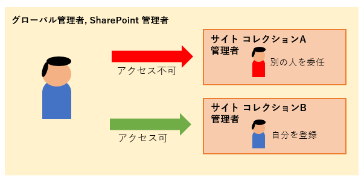
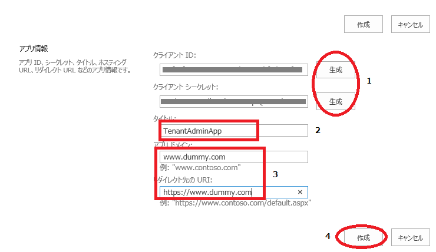
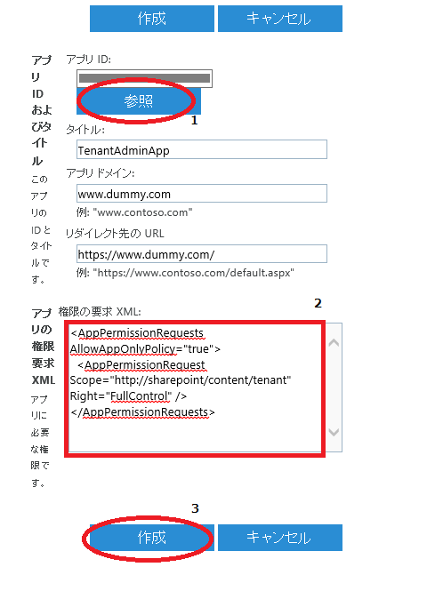

# PnP PowerShell でテナントのフルコントロール権限を使用して接続する方法について

## 背景
テナント管理者として、PowerShell でテナント全体のサイト コンテンツに対し、何らかの操作を実施しようとした際には、アクセス権の問題が頻繁に浮上します。

Office 365 管理センターで指定した全体管理者または SharePoint 管理者の権限がある場合、あらゆる設定を実施することは可能です。
しかし、サイト コレクション管理者を別の管理者に委任している場合、自身に該当サイトの管理者権限が与えられていないと、そのままの状態でサイトの変更をしたりコンテンツを閲覧できるわけではありません。



このような状況においては、何かテナント単位で各サイトに対する作業を実施しようとした際に、一時的に自分に各サイト コレクションの管理者権限を付与してから作業せざるを得ない状況に陥ります。SharePoint 管理ポータルや、Set-SPOUser -IsSiteCollectionAdmin $true などで設定は可能です。
しかし、多くのサイト コレクションの列挙など、一般的にこの追加実装や作業は、時間がかかることが予測されます。

## 対処策
アプリ専用トークンを使用して、アプリにテナントに対する管理者権限を割り当てることができます。手順は以下のサイトにも記載があります。より詳細な情報については確認ください。

タイトル : SharePoint アプリ専用のアクセスを許可する
アドレス : https://docs.microsoft.com/ja-jp/sharepoint/dev/solution-guidance/security-apponly-azureacs

### 手順
**1) ブラウザーで https://{tenant}.sharepoint.com/_layouts/15/appregnew.aspx を呼び出します。**
{tenant} の部分は、ご利用のテナント プリフィックスに基づいたアドレスに変えてください。

**イメージ**<br>


 1-1) クライアント ID とクライアント シークレットにて、それぞれ [生成] をクリックします。
 1-2) タイトルに任意の名前をしています。
 1-3) アプリドメインとリダイレクト先の URI には、指定のようにダミー値を記載します。
  (サーバー利用しませんので、ダミーで問題ありません。)
 1-4) [作成] をクリックします。
 **1-5) 次の画面で表示されるアプリの情報を厳重に保管してください。**

**2) 次にブラウザーで https://{tenant}-admin.sharepoint.com/_layouts/15/appinv.aspx を呼び出します。**
 2-1) アプリ ID に、先ほど登録したクライアント ID を入力して、アプリの情報を呼び出します。
 2-2) アプリのアクセス許可を付与するために XML を記載します。

 ``` XML
<AppPermissionRequests AllowAppOnlyPolicy="true">
  <AppPermissionRequest Scope="http://sharepoint/content/tenant" Right="FullControl" />
</AppPermissionRequests>
```

 2-3) [作成] をクリックします。 

**イメージ**<br>


 2-4) [信頼する] をクリックします。

**イメージ**<br>


 2-5) テナントでレガシーのアプリ専用トークンを有効化します。
   2020 年夏頃以降に新規作成したテナントにおいて、アプリ専用トークンが既定で無効化されている場合があります。その場合は [SharePoint Online 管理シェル](https://support.microsoft.com/ja-jp/office/c16941c3-19b4-4710-8056-34c034493429) を使用してテナントの設定を変更ください。

``` PowerShell
Set-SPOTenant -DisableCustomAppAuthentication $FALSE
```

**3) PnP PowerShell で以下のように接続します。後は、続けてコマンドレットを実行ください。**

``` PowerShell
Connect-PnPOnline https://{tenant}.sharepoint.com -ClientId <クライアント ID> -ClientSecret <クライアント シークレット>
```

## 注意
アプリ専用トークンは、非常に強力です。しかし、クライアント ID やシークレットとなる情報に尽きましては、管理者アカウント・パスワードと同様、厳重に管理してくださいますようお願いします。

## その他
Get-PnPContext コマンドを実行することで、ClientContext オブジェクトを取得できるため、このオブジェクトから利用できる様々な処理を実行することが可能です。
運用シナリオに応じて、CSOM 標準で用意されているコマンドレットとは別の処理を実行することができます。


## 参考リンク

タイトル : PnP PowerShell の概要
アドレス : https://learn.microsoft.com/ja-jp/powershell/sharepoint/sharepoint-pnp/sharepoint-pnp-cmdlets