# SharePoint Modernization Scanner を使用して、移行対象のワークフローを抽出する

今回の投稿では、SharePoint Online における [SharePoint 2010 形式ワークフローの廃止](https://support.microsoft.com/ja-jp/office/1ca3fff8-9985-410a-85aa-8120f626965f?ui=ja-jp&rs=ja-jp&ad=jp) (MC217999) に際しての計画段階において、移行対象のワークフローを抽出する方法を詳細に記載します。

そのためのツールとして、SharePoint Modernization Scanner (SharePoint モダン化スキャナー) が公開されています。

最初に、移行する SharePoint 2010 形式ワークフローの全体像をつかむことは必須の作業となります。これをもとに、技術的な課題項目を整理したり、工数を見積もるという作業が派生してくると思います。
本投稿では、できる限りスムーズに移行検討作業に移れるよう、現バージョンの SharePoint モダン化スキャナーによる操作イメージを画面付きで紹介します。

## 1. 最初に下記サイトからツールをダウンロードします。

タイトル : SharePoint モダン化スキャナーを使い始める
アドレス : https://docs.microsoft.com/ja-jp/sharepoint/dev/transform/modernize-scanner

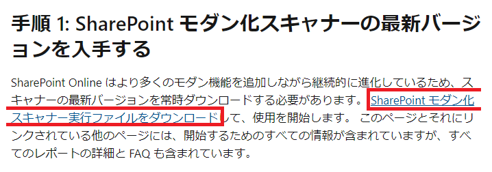

## 2. ダウンロードしたツールを実行します。

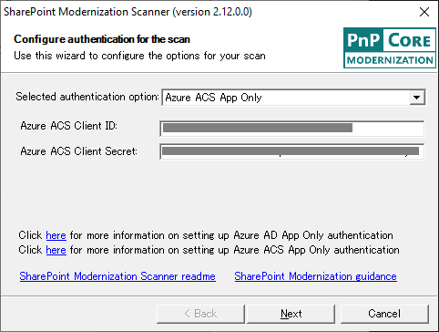

### 2-1. クライアント ID とクライアント シークレットを用意します。
Selected Authentication Option ですが、テナント全体に対して実行する場合は、あらかじめテナント内の全サイト コレクションにアクセス可能なユーザーが用意できない場合は、アプリ専用トークンを利用することが現実的です。
アプリ専用トークンの種類は 2 種類あります。一般的にはライフサイクルを考慮した場合、継続的なアプリケーションの開発や利用を想定した場合は Azure AD App Only が推奨されますが、どちらでも現時点での機能面に変わりはないため、今回の一時的な利用においては操作が簡単な Azure ACS App Only のシナリオを進めていただくことで問題はありません。

別途以下のサイトなどの手順で Azure ACS クライアント ID と クライアント シークレットを入手します。

タイトル : PnP PowerShell でテナントのフルコントロール権限を使用して接続する方法について
アドレス : https://jpspsupport.github.io/blog/sharepoint-online/pnp-powershell-with-app-only-token/

なお、上記サイトはテナントに対してフルコントロール権限でアプリを払い出しておりますので、適宜権限要求 XML を変更してサイトに対するフルコントロール等に変更していただいてもかまいません。

### 2-2. クライアント ID とクライアント シークレットを入力して [Next] をクリックします
### 2-3. 対象を指定して [Next] をクリックします。

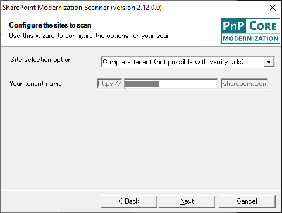

## 3. Scan mode には Classic workflow usage を指定ください。

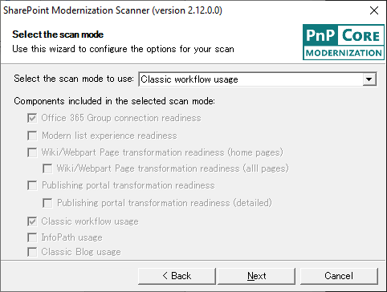

## 4.	最後に細かな設定が可能ですが、[Start Scan] を押すと開始します。

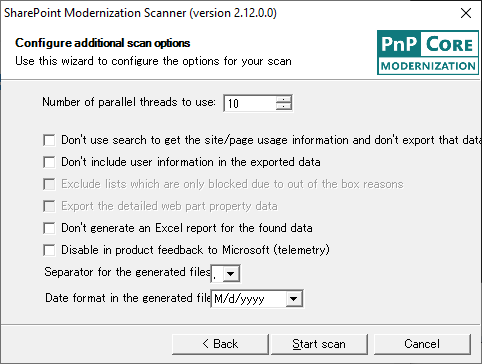

## 5. 実行時にはコマンド プロンプトに進捗が書かれます。

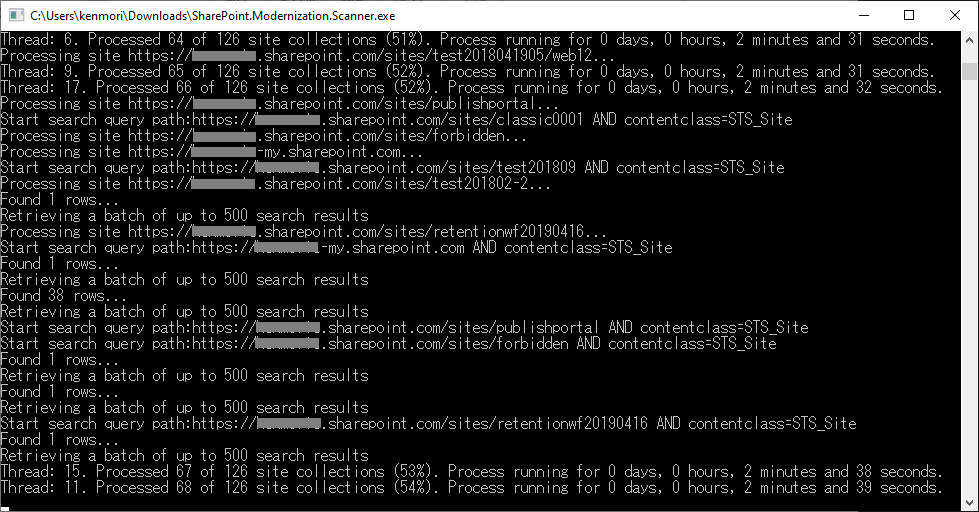

## 6. コマンド実行が完了すると、フォルダーが実行プログラム (*.EXE) と同一階層に現れます。

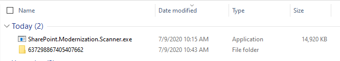

## 7. フォルダー内には以下のようなファイルが入っています。

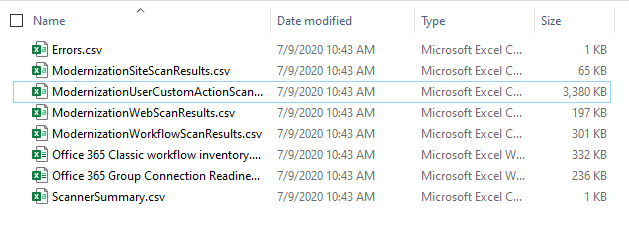

## 8. ModernizationWorkflowScanResults.csv を開きます。

日本語が含まれる場合は、一度ファイルをメモ帳で開いて、名前を付けて保存し、UTF8 BOM 付きで保存しなおし、その後 Excel で開きます。

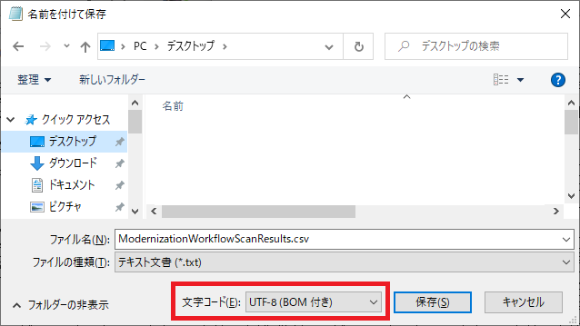

Windows 10 以前の OS をご利用の場合は UTF-8 (BOM 付き) の文字コードが指定できない場合があります。この場合は、UTF-8 として上書き保存すれば明示的に BOM が指定されます。
手順 9 で Excel データが文字化けしている場合は、この手順がスキップされていることに起因します。

## 9. シート上のセルをテーブルに変換し、フィルターを使用して、置き換え対象のワークフローを絞り込んでいきます。

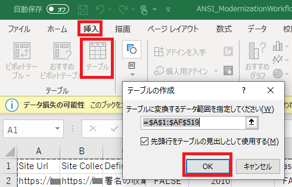

例
* SharePoint 2010 形式ワークフロー (Version = 2010)
* リストで新規インスタンスを許可されている (Enabled = True) 

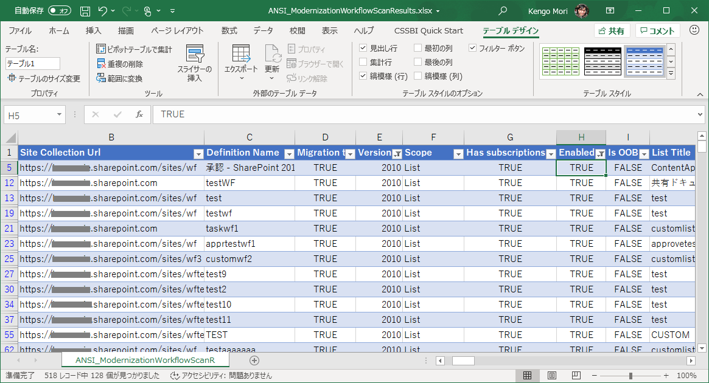

この時点で、使用中のワークフロー一覧については抽出完了です。
サイト コレクション管理者にコンテンツを委任している場合は、各サイト コレクション管理者に MC217999 の内容や告示内容、各サイト コレクションごとの抽出データとあわせ、Admins 列に格納されたユーザーに共有して連携してください。

